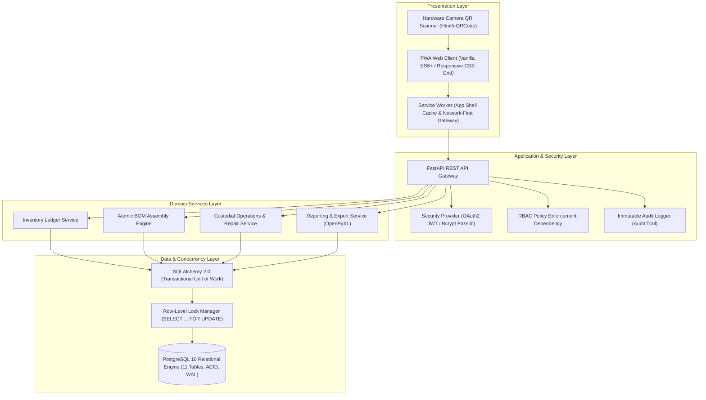

# 🛸 Deus Drones ERP
> **Enterprise Resource Planning, Hardware BOM Assembly, and End-to-End Component Traceability Platform for Unmanned Aerial Systems (UAS)**

---

## 1. Executive Summary

**Deus Drones ERP** is an industrial-grade enterprise inventory, assembly, and lifecycle traceability system engineered for high-throughput unmanned aerial systems (UAS) workshops, avionics integration labs, and rapid maintenance depots. 

The platform addresses critical supply chain and engineering bottlenecks in multi-tier hardware production:
- **Zero-Loss Part Traceability:** Strict forward and backward tracking of discrete avionics components (flight controllers, ESC stacks, VTX transmitters, optical payloads, motors) from inbound procurement to specific assembled airframes.
- **Atomic BOM Assembly:** Transactional Bill of Materials (BOM) execution preventing inventory desynchronization and component double-spending during concurrent workshop operations.
- **Readiness State Governance:** A standardized Finite State Machine (FSM) governing operational readiness (`G0` to `G3`) and maintenance lifecycles.
- **Field-Proof Identification:** Anti-enumeration, cryptographically tokenized QR codes for rapid mobile camera scanning in workshop environments.

---

## 2. Core Functional Modules

### 2.1. Dual-Mode Inventory Ledger
The inventory engine categorizes equipment into **14 standardized hardware domains**, operating under two distinct mathematical accounting models:
- **Piece-wise Serialized Accounting (`PIECE`):** Unique serial serialization with individual unit records, dedicated QR verification tokens, and strict 1-to-1 operational custody (e.g., assembled drones, specialized optical payloads, radio ground stations).
- **Bulk Batch Accounting (`BULK`):** Grouped inventory managed by fractional decimal quantities, shared SKU/QR codes, and atomic deductions during assembly or maintenance (e.g., motors, structural carbon components, wiring harnesses, RF antennas).

### 2.2. Atomic Bill of Materials (BOM) Assembly Engine
- **Predefined Engineering Templates:** Standardized BOM recipes for fixed configurations (e.g., 7-inch tactical multirotor units, 10-inch heavy payload carriers, optical reconnaissance airframes).
- **Multi-Table Atomic Deductions:** Dynamic selection of serialized avionics modules combined with bulk stock reductions executed within a single database transaction (`SELECT ... FOR UPDATE` isolation).
- **Referential Protection (`ON DELETE RESTRICT`):** Assembled airframes retain permanent, immutable relational links to all consumed sub-assemblies, preventing accidental ledger deletion.

### 2.3. Operational Movement & Fleet Maintenance
- **Custody Transfers:** Real-time check-out / check-in logging with timestamped custodial assignments.
- **Automated Overdue Enforcement:** Continuous calculation of delinquent return schedules against designated operational return dates.
- **Depot Maintenance Journal:** Granular failure logging, repair cost calculation, component swap tracking, and post-service readiness reclassification.

### 2.4. Governance & Immutable Audit Logging
- **Append-Only Audit Trail:** Detailed mutation logging capturing actor ID, timestamp, client network address, mutated entity, and full JSON payload state deltas.
- **Controlled Taxonomies:** Critical categorical fields (`Readiness Class`, `Operational Condition`, `Completeness`) are strictly constrained to predefined database enums, blocking arbitrary user text input.

---

## 3. High-Level Architecture

The platform is designed as an enterprise **Modular Monolith** prioritizing operational resilience, deterministic state management, and rapid deployment.

---

## 4. Technical Stack

| Tier | Technology | Technical Purpose |
|---|---|---|
| **Backend Engine** | Python 3.11+, FastAPI, Starlette | High-performance asynchronous REST API framework |
| **ORM & Concurrency** | SQLAlchemy 2.0, PostgreSQL Driver | Declarative relational schema, session lifecycle, row-level locks |
| **Database Engine** | PostgreSQL 16 (ACID, WAL enabled) | Relational storage with strict foreign keys and check constraints |
| **Authentication & RBAC** | OAuth2 Password Bearer, JWT (HS256), Bcrypt | Stateless cryptographic session tokens and role gating |
| **Client UI Shell** | HTML5, CSS3 Variables, Vanilla JavaScript (ES6) | Framework-less, dependency-free responsive interface |
| **Mobile Integration** | Service Worker, Web App Manifest | Installable Progressive Web Application (PWA) with offline shell |
| **Optical Identification** | Html5-QRCode, QRCode.js | Client-side cryptographic QR generation and camera decoding |
| **Document Generation** | OpenPyXL, Print-Optimized CSS | Structured spreadsheet exports and standardized technical transfer forms |

---

## 5. Role-Based Access Control (RBAC)

The system enforces the Principle of Least Privilege (PoLP) across three standardized operational roles:

| Operational Capability | Worker (`worker`) | Lead Technician (`leader`) | Administrator (`admin`) |
|---|:---:|:---:|:---:|
| Read Inventory Registry & Search | ✅ | ✅ | ✅ |
| Scan & Resolve Optical QR Codes | ✅ | ✅ | ✅ |
| Execute Custody Check-out / Check-in | ✅ | ✅ | ✅ |
| Submit Depot Repair Tickets | ✅ | ✅ | ✅ |
| Execute BOM Airframe Assemblies | ❌ | ✅ | ✅ |
| Create / Decommission Inventory SKUs | ❌ | ✅ | ✅ |
| Export Analytical Reports & Transfer Deeds | ❌ | ✅ | ✅ |
| Inspect Immutable Audit Trail Logs | ❌ | ✅ | ✅ |
| Manage User Credentials & Roles | ❌ | ❌ | ✅ |
| Trigger Database Backups & Restores | ❌ | ❌ | ✅ |

---

## 6. Reliability & Disaster Recovery Highlights

- **Concurrency Protection:** Row-level locks (`SELECT ... FOR UPDATE`) eliminate lost updates during simultaneous multi-terminal inventory operations.
- **Recovery Point Objective (RPO):** $< 24$ hours via automated daily PostgreSQL dump execution.
- **Recovery Time Objective (RTO):** $< 15$ minutes via automated database restore pipelines.
- **Retention & Backup Rotation:** Automated 7-snapshot rolling retention pool with SHA-256 integrity logging.

---

## 7. Specifications & Documentation Index

For exhaustive technical specifications, refer to the respective architectural blueprints:

- 🏛️ **[System Architecture Specification](ARCHITECTURE.md)** — IEEE 1016 design document, ER diagrams, atomic transaction models, and sequence workflows.
- 🔄 **[Traceability & Hardware Lifecycle](TRACEABILITY_AND_LIFECYCLE.md)** — Dual-mode inventory models, G0–G3 readiness finite state machines, and component genealogy.
- 🛡️ **[Security, Governance & Resilience](SECURITY_AND_RELIABILITY.md)** — Threat modeling (STRIDE), QR tokenization architecture, RBAC implementation, and disaster recovery.
