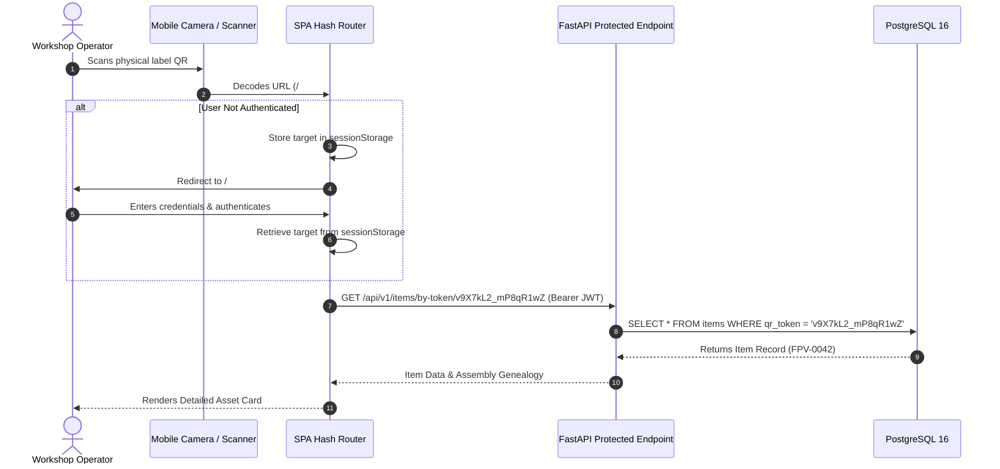
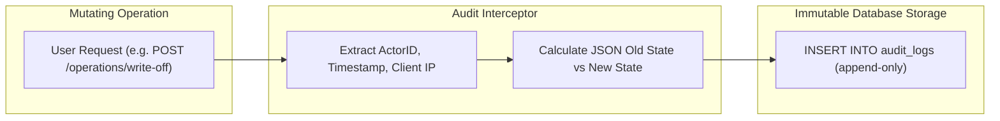

# Security, Governance & Reliability Architecture (Deus Drones ERP)

---

## 1. Threat Modeling (STRIDE Methodology)

Workshop inventory and assembly platforms deployed in sensitive hardware environments are subject to adversarial reconnaissance, unauthorized inventory modification, and physical asset tampering. The system implements mitigations structured according to the **STRIDE** model:

| Threat Category | Potential Attack Vector | Architectural Mitigation |
|---|---|---|
| **Spoofing** | Forged technician identity or credential theft | Strong Bcrypt password hashing ($\text{work factor} \ge 12$), stateless signed JWT authentication with configurable expiration. |
| **Tampering** | Unauthorized status mutation (e.g., marking broken unit as mission-ready) | Server-side RBAC policy enforcement at the API boundary; client UI restrictions mirror backend dependency guards. |
| **Repudiation** | Operator denies issuing, modifying, or writing off equipment | Immutable append-only `AuditLog` capturing actor ID, timestamp, client IP, action name, and JSON state diffs. |
| **Information Disclosure** | Scraping total inventory numbers via predictable QR URLs | Cryptographic tokenization (`secrets.token_urlsafe(16)`) eliminating sequential asset enumeration. |
| **Denial of Service** | Concurrent request flood exhausting database connections | Transaction timeout constraints, connection pooling with overflow limits, and row-level lock timeouts. |
| **Elevation of Privilege** | Low-privilege worker attempting to execute BOM assemblies or user creation | Role gating enforced by FastAPI dependency injection (`require_role(["leader", "admin"])`). |

---

## 2. Cryptographic QR Tokenization & Anti-Enumeration

### The Sequential Identifier Vulnerability
Early inventory systems often embed sequential identifiers directly into barcode or QR payloads (e.g., `https://erp.local/#/item/FPV-0042`). In tactical or competitive environments, this architecture leaks strategic operational intelligence:
- Attackers can enumerate the full hardware inventory through simple incremental queries (`FPV-0001`, `FPV-0002`, ...).
- Adversaries can deduce total manufacturing throughput, component depletion rates, and current fleet sizes.

### Cryptographic Token Architecture
To mitigate enumeration attacks, every physical asset receives an opaque, cryptographically random verification token generated via high-entropy OS randomness:

```python
import secrets

def generate_secure_qr_token() -> str:
    """Generates a 128-bit cryptographically secure, URL-safe random token.
    Entropy: 2^128 possible combinations, making brute-force enumeration 
    computationally infeasible.
    """
    return secrets.token_urlsafe(16)
```



---

## 3. Role-Based Access Control (RBAC) Architecture

Authentication uses OAuth2 Password Bearer flow with HS256 signed JSON Web Tokens (JWT). Authorization is applied per-endpoint via FastAPI dependency injection:

```python
def require_role(allowed_roles: list[RoleEnum]):
    """Enforces role-based authorization at the REST endpoint level."""
    def role_checker(current_user: User = Depends(get_current_user)):
        if current_user.role not in allowed_roles:
            raise HTTPException(
                status_code=status.HTTP_403_FORBIDDEN,
                detail="Access denied: Insufficient operational privileges"
            )
        return current_user
    return role_checker
```

### Complete Operational Privilege Matrix

| Module / Endpoint | HTTP Method | `worker` | `leader` | `admin` |
|---|:---:|:---:|:---:|:---:|
| **Authentication** (`/auth/login`, `/auth/me`) | `POST`, `GET` | ✅ | ✅ | ✅ |
| **Read Inventory Registry** (`/api/v1/items`) | `GET` | ✅ | ✅ | ✅ |
| **Resolve Item by QR Token** (`/api/v1/items/by-token/*`) | `GET` | ✅ | ✅ | ✅ |
| **Check-out / Check-in Asset** (`/operations/issue-return`) | `POST` | ✅ | ✅ | ✅ |
| **Create Maintenance Ticket** (`/operations/repair`) | `POST` | ✅ | ✅ | ✅ |
| **Close Maintenance Ticket** (`/operations/repair/{id}/close`) | `POST` | ✅ | ✅ | ✅ |
| **Execute BOM Assembly** (`/api/v1/assembly/build`) | `POST` | ❌ | ✅ | ✅ |
| **Create / Edit Inventory SKU** (`/api/v1/items`) | `POST`, `PUT` | ❌ | ✅ | ✅ |
| **Decommission / Scrapping** (`/operations/write-off`) | `POST` | ❌ | ✅ | ✅ |
| **Register Inbound Purchase** (`/operations/purchase`) | `POST` | ❌ | ✅ | ✅ |
| **Export Registry to Excel** (`/api/v1/export/excel`) | `GET` | ❌ | ✅ | ✅ |
| **Inspect Audit Trail** (`/api/v1/audit`) | `GET` | ❌ | ✅ | ✅ |
| **User Account Administration** (`/api/v1/users/*`) | `ALL` | ❌ | ❌ | ✅ |
| **Trigger System Backups** (`/api/v1/system/backup`) | `POST` | ❌ | ❌ | ✅ |

---

## 4. Immutable Audit Trail Architecture

All state mutations (modifications to inventory balance, custodial changes, repairs, and deletions) pass through a centralized auditing interceptor:



### Audit Record Schema:
- **`actor_id`:** Relational foreign key referencing the executing user account.
- **`client_ip` & `user_agent`:** Network origin metadata for forensic attribution.
- **`action`:** Deterministic operation tag (`ITEM_CREATED`, `CUSTODY_ISSUED`, `MAINTENANCE_CLOSED`, `ASSEMBLY_EXECUTED`).
- **`old_state` & `new_state`:** Full JSONB structured snapshots capturing exact property deltas.
- **Immutability Guarantee:** No `UPDATE` or `DELETE` API endpoints exist for `audit_logs`. Database triggers or restricted user grants prevent retroactive modification.

---

## 5. Resilience, Disaster Recovery & Automated Backup Rotation

High-reliability engineering requires robust disaster recovery protocols capable of restoring full operational capacity in the event of hardware or storage failure.

```mermaid
graph TD
    subgraph DailyExecution [Automated Daily Trigger (23:00)]
        Sched["Scheduled Task / Cron Engine"]
    end

    subgraph DumpProcess [PostgreSQL Backup Pipeline]
        Dump["pg_dump.exe --format=custom --blobs"]
        Verify["Verify Snapshot Integrity & Non-Zero File Size"]
        Log["Append to backup_history.log (Timestamp, Size, Status)"]
    end

    subgraph Retention [7-Day Rolling Retention Pool]
        Pool["backups/deus_drones_backup_YYYYMMDD_HHMMSS.sql"]
        Rotate["Prune Snapshots Older than 7 Days (FIFO)"]
    end

    Sched --> Dump
    Dump --> Verify
    Verify --> Log
    Log --> Pool
    Pool --> Rotate
```

### Operational Recovery Metrics:
- **Recovery Point Objective (RPO):** $< 24$ hours. In the event of catastrophic storage failure, maximum potential data loss is limited to transactions committed since the last automated nightly dump.
- **Recovery Time Objective (RTO):** $< 15$ minutes. Automated restore scripts can re-provision the relational schema, foreign key constraints, and table datasets from raw `.sql` or custom-format dumps within minutes.
- **Retention Policy (FIFO Rotation):** The automated backup engine maintains a strict rolling pool of the **7 most recent snapshots**, preventing storage volume exhaustion on host systems.

---

## 6. Related Technical Specifications

- 📄 **[System Landing & Project Overview](README.md)**
- 🏛️ **[System Architecture Specification](ARCHITECTURE.md)**
- 🔄 **[Traceability & Hardware Lifecycle](TRACEABILITY_AND_LIFECYCLE.md)**
