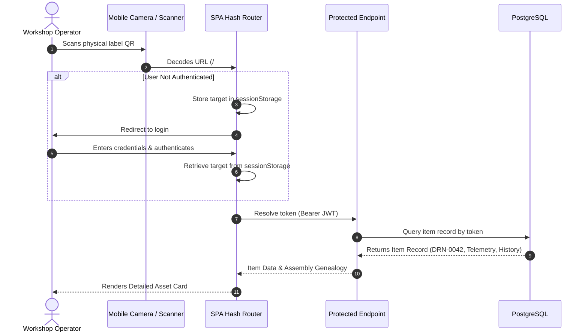
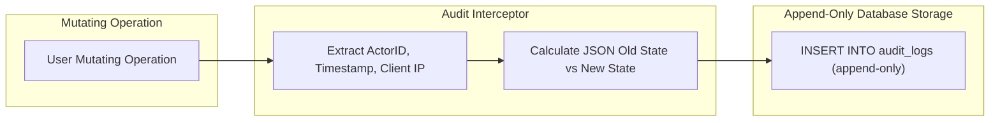
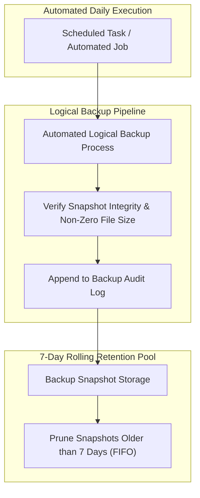

# Security, Governance & Reliability Architecture (Deus Drones ERP)

---

## 1. Threat Modeling (STRIDE Methodology)

Workshop inventory and assembly platforms deployed in sensitive hardware environments are subject to unauthorized reconnaissance, illicit inventory modification, and physical asset tampering. The system implements mitigations structured according to the **STRIDE** model:

| Threat Category | Potential Attack Vector | Architectural Mitigation |
|---|---|---|
| **Spoofing** | Forged technician identity or credential theft | Adaptive password hashing, signed tokens, and role-based session verification. |
| **Tampering** | Unauthorized status mutation (e.g., marking broken unit as operational) | Server-side RBAC policy enforcement at the API boundary; client UI restrictions mirror backend dependency guards. |
| **Repudiation** | Operator denies issuing, modifying, or writing off equipment | Append-only (application-level) `AuditLog` capturing actor ID, timestamp, client IP, action name, and JSON state diffs. |
| **Information Disclosure** | Scraping total inventory numbers via predictable QR URLs | Cryptographic tokenization using high-entropy random tokens eliminating sequential asset enumeration. |
| **Denial of Service** | Concurrent request flood exhausting database connections | Transaction timeout constraints, connection pooling with overflow limits, and row-level lock timeouts. |
| **Elevation of Privilege** | Low-privilege worker attempting to execute BOM assemblies or user creation | Role gating enforced by FastAPI dependency injection (`require_role(["leader", "admin"])`). |

---

## 2. Cryptographic QR Tokenization & Anti-Enumeration

### The Sequential Identifier Vulnerability
Early inventory systems often embed sequential identifiers directly into barcode or QR payloads (e.g., `https://<internal-host>/#/item/<opaque-token>`). In competitive environments, this architecture leaks operational intelligence:
- Unauthorized parties can enumerate the full hardware inventory through simple incremental queries.
- Unauthorized parties can deduce total manufacturing throughput, component depletion rates, and current fleet sizes.

### Cryptographic Token Architecture
To mitigate enumeration attacks, every physical asset receives an opaque, cryptographically random verification token generated via high-entropy OS randomness:

```python
import secrets

def generate_secure_token() -> str:
    """Generates a 128-bit cryptographically secure, URL-safe random token.
    Entropy: 2^128 possible combinations, making brute-force enumeration 
    computationally infeasible.
    """
    return secrets.token_urlsafe(16)
```


```mermaid
sequenceDiagram
    autonumber
    actor Tech as Workshop Operator
    participant Cam as Mobile Camera / Scanner
    participant Router as SPA Hash Router
    participant API as Protected Endpoint
    participant DB as PostgreSQL

    Tech->>Cam: Scans physical label QR
    Cam->>Router: Decodes URL (/#/item/OPAQUE_TOKEN)
    
    alt User Not Authenticated
        Router->>Router: Store target in sessionStorage
        Router->>Tech: Redirect to login
        Tech->>Router: Enters credentials & authenticates
        Router->>Router: Retrieve target from sessionStorage
    end
    
    Router->>API: Resolve token (Bearer JWT)
    API->>DB: Query item record by token
    DB-->>API: Returns Item Record (DRN-0042, Telemetry, History)
    API-->>Router: Item Data & Assembly Genealogy
    Router-->>Tech: Renders Detailed Asset Card
```

---

## 3. Role-Based Access Control (RBAC) Architecture

Authentication uses OAuth2 Password Bearer flow with signed JSON Web Tokens (JWT). Authorization is applied per-endpoint via FastAPI dependency injection:

```python
def require_role(allowed_roles: list[RoleEnum]):
    """Enforces role-based authorization at the REST endpoint level."""
    def role_checker(current_user: User = Depends(get_current_user)):
        if current_user.role not in allowed_roles:
            raise HTTPException(
                status_code=status.HTTP_403_FORBIDDEN,
                detail="Access denied: Insufficient operational privileges"
            )
        return current_user
    return role_checker
```

### Complete Operational Capability Matrix

| Operational Capability | `worker` | `leader` | `admin` |
|---|:---:|:---:|:---:|
| User Authentication & Session Verification | ✅ | ✅ | ✅ |
| Read Inventory Registry & Search | ✅ | ✅ | ✅ |
| Resolve Item by QR Token | ✅ | ✅ | ✅ |
| Check-out / Check-in Asset Assignment | ✅ | ✅ | ✅ |
| Create & Transition Production Orders | ✅ | ✅ | ✅ |
| Submit Workshop Repair Tickets | ✅ | ✅ | ✅ |
| Close Workshop Repair Tickets | ✅ | ✅ | ✅ |
| Govern Order Costs, Pricing & Margins | ❌ | ✅ | ✅ |
| Inspect Financial Analytics & Valuation | ❌ | ✅ | ✅ |
| Execute BOM Platform Assembly | ❌ | ✅ | ✅ |
| Create / Edit Inventory SKUs & Templates | ❌ | ✅ | ✅ |
| Asset Scrapping & De-allocation (Write-off) | ❌ | ✅ | ✅ |
| Register Inbound Component Procurement | ❌ | ✅ | ✅ |
| Export Registry & Analytical Reports | ❌ | ✅ | ✅ |
| Inspect Append-Only Audit Trail Logs | ❌ | ✅ | ✅ |
| User Account Administration & Role Management | ❌ | ❌ | ✅ |
| Trigger Database Backups & Restores | ❌ | ❌ | ✅ |

---

## 4. Append-Only (Application-Level) Audit Trail Architecture

All state mutations (modifications to inventory balance, assignment changes, repairs, and deletions) pass through a centralized auditing interceptor:


```mermaid
graph LR
    subgraph Action [Mutating Operation]
        Req["User Mutating Operation"]
    end

    subgraph Interceptor [Audit Interceptor]
        Extract["Extract ActorID, Timestamp, Client IP"]
        Diff["Calculate JSON Old State vs New State"]
    end

    subgraph LogTable [Append-Only Database Storage]
        AuditEntry["INSERT INTO audit_logs (append-only)"]
    end

    Req --> Extract
    Extract --> Diff
    Diff --> AuditEntry
```

### Audit Record Schema:
- **`actor_id`:** Relational foreign key referencing the executing user account.
- **`client_ip` & `user_agent`:** Network origin metadata for forensic attribution.
- **`action`:** Deterministic operation tag (`ITEM_CREATED`, `ASSIGNMENT_ISSUED`, `MAINTENANCE_CLOSED`, `ASSEMBLY_EXECUTED`, `ORDER_STATUS_CHANGED`).
- **`entity_code` & Sanitization:** String identifiers capped at 64 characters to eliminate `StringDataRightTruncation` exceptions across variable-length component SKUs.
- **`old_state` & `new_state`:** Full JSONB structured snapshots capturing exact property deltas.
- **Application-Level Immutability:** No `UPDATE` or `DELETE` API endpoints exist for `audit_logs`; mutations are strictly append-only.

---

## 5. Resilience, Disaster Recovery & Automated Backup Rotation

High-reliability engineering requires robust disaster recovery protocols capable of restoring full operational capacity in the event of hardware or storage failure. The system implements automated nightly logical backups with integrity verification and rolling retention.


```mermaid
graph TD
    subgraph DailyExecution [Automated Daily Execution]
        Sched["Scheduled Task / Automated Job"]
    end

    subgraph DumpProcess [Logical Backup Pipeline]
        Dump["Automated Logical Backup Process"]
        Verify["Verify Snapshot Integrity & Non-Zero File Size"]
        Log["Append to Backup Audit Log"]
    end

    subgraph Retention [7-Day Rolling Retention Pool]
        Pool["Backup Snapshot Storage"]
        Rotate["Prune Snapshots Older than 7 Days (FIFO)"]
    end

    Sched --> Dump
    Dump --> Verify
    Verify --> Log
    Log --> Pool
    Pool --> Rotate
```

### Operational Recovery Metrics:
- **Recovery Point Objective (RPO) Design Target:** $< 24$ hours. In the event of catastrophic storage failure, maximum potential data loss is limited to transactions committed since the last automated nightly dump.
- **Recovery Time Objective (RTO) Design Target:** $< 15$ minutes. Automated restore procedures can re-provision the relational schema, foreign key constraints, and table datasets from backup snapshots within minutes.
- **Retention Policy (FIFO Rotation):** The automated backup engine maintains a strict rolling pool of the **7 most recent backup snapshots**, preventing storage volume exhaustion on host systems.

---

## 6. Related Technical Specifications

- [System Landing & Project Overview](README.md)
- [System Architecture Specification](ARCHITECTURE.md)
- [Traceability & Hardware Lifecycle](TRACEABILITY_AND_LIFECYCLE.md)
