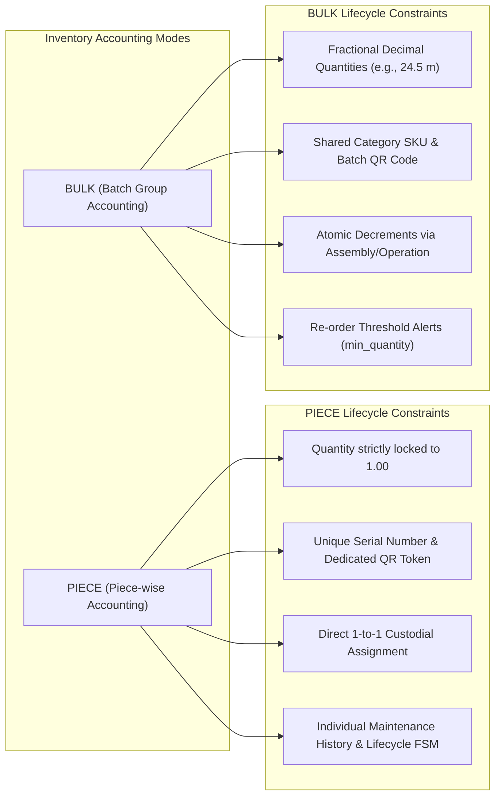
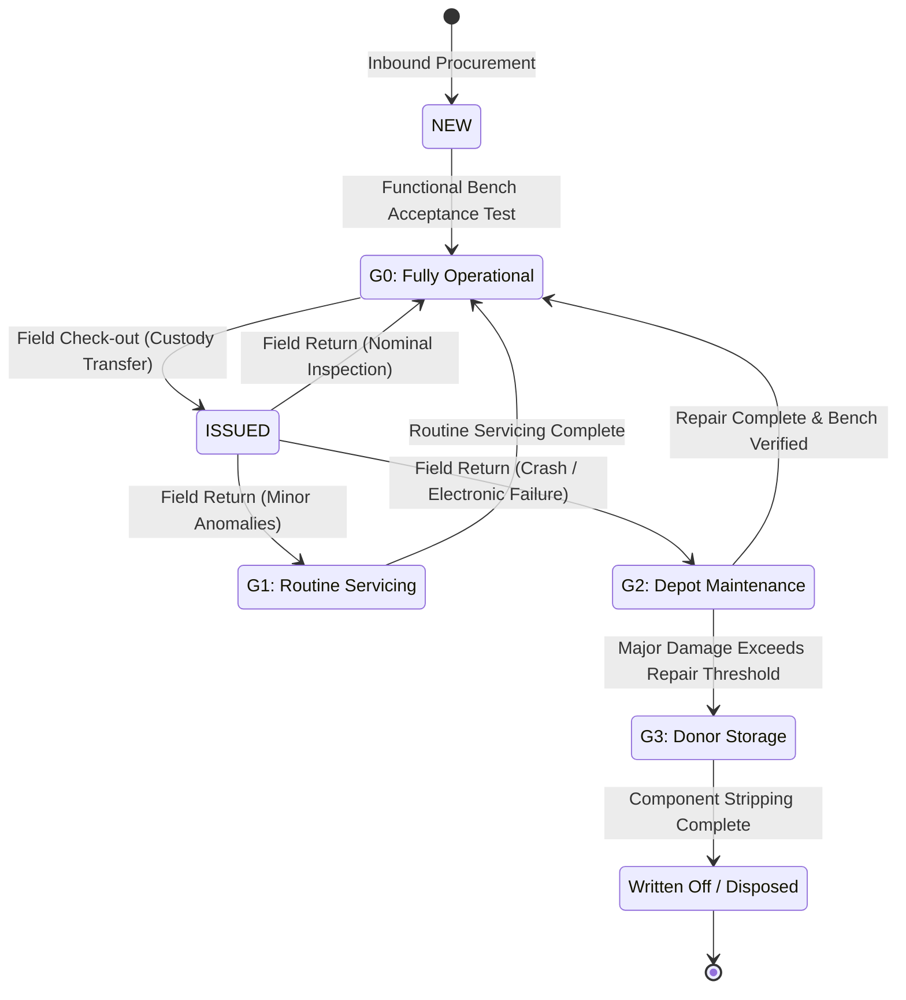
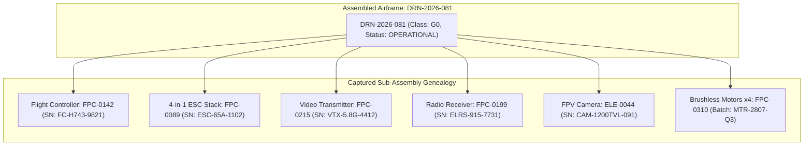

# Hardware Traceability, Taxonomy & Lifecycle Specification (Deus Drones ERP)

---

## 1. Domain Scope & Inventory Classification

Managing hardware assembly and operational maintenance for unmanned aerial systems (UAS) requires strict separation between discrete serialized assets and consumable batch commodities. **Deus Drones ERP** classifies all inventory into **14 standardized categories**, mapping each to a deterministic prefix and an accounting paradigm:

| Category Name | SKU Prefix | Accounting Type | Primary Inventory Classification |
|---|:---:|:---:|---|
| **Antennas & RF** | `ANT` | `BULK` | Telemetry & Video Transceiver Antennas (SMA/RP-SMA/ipex) |
| **Cabling & Wire** | `CAB` | `BULK` | Power harnesses, silicon wiring, signal leads |
| **Optical Fiber** | `FIB` | `BULK` | High-bandwidth tethering and optical spools |
| **3D Printing Equipment** | `3DP` | `PIECE` | Additive manufacturing stations, custom enclosures |
| **FPV Airframes** | `FPV` | `PIECE` | Serialized high-speed tactical multirotor airframes |
| **FPV Components** | `FPC` | `BULK` | Motors, ESC speed controllers, flight controllers, VTX modules |
| **Heavy Multirotors** | `BIG` | `PIECE` | Heavy payload hexacopters and delivery airframes |
| **Reconnaissance UAVs** | `REC` | `PIECE` | Long-endurance fixed-wing or tactical surveillance platforms |
| **Ground Robotics** | `NRK` | `PIECE` | Unmanned ground vehicles (UGV) and relay stations |
| **Avionics & Optics** | `ELE` | `BULK` | Thermal sensors, FPV cameras, GPS compass modules |
| **Workshop Tooling** | `TLS` | `BULK` | Precision soldering stations, calibration benches, torque drivers |
| **Raw Materials** | `MAT` | `BULK` | Carbon sheets, heat shrink, thread-lockers, structural solder |
| **Station Equipment** | `EQP` | `PIECE` | Lab oscilloscopes, benchtop power units, radio spectrum analyzers |
| **General Ancillary** | `OTH` | `BULK` | Packaging, field cases, mounting hardware |

---

## 2. Dual-Mode Accounting Paradigm

### Deterministic Identifier Generation
Inventory numbers are generated dynamically on insertion using an atomic category-scoped sequence:
$$\text{InventoryNumber} = \text{Prefix} - \text{PadZeroes}(\text{SequenceNumber}, 4)$$
*Example:* The third registered FPV airframe receives the permanent identifier `FPV-0003`.

---

## 3. Readiness Classification Finite State Machine (FSM)

Hardware deployed in active workshop operations is evaluated across two orthogonal parameters: **Operational Status** and **Mission Readiness Class (`G0`–`G3`)**.

### 3.1. Readiness Classes (`readiness_class`)
- **`G0` (Mission Ready):** Airframe or sub-assembly passes 100% of functional pre-flight diagnostics, bench telemetry checks, and RF power output validation. Ready for immediate deployment.
- **`G1` (Minor Servicing):** Hardware fully functional but requires minor scheduled inspection, propeller balancing, firmware configuration updates, or cosmetic hardware adjustments.
- **`G2` (Depot Repair):** Hardware unserviceable due to component failure, crash damage, or desoldered electronic connections. Requires workbench diagnostics and component replacement.
- **`G3` (Decommissioned / Donor):** Hardware damaged beyond economically viable repair. Retained in storage strictly as a donor source for salvageable sub-components (screws, arms, functional sensors).

### 3.2. FSM State Transition Workflow

### 3.3. State Mutation Rules
1. **Immutable Historical Records:** Status transitions cannot overwrite historical records. Every transition creates an immutable journal entry (`IssueReturn`, `Repair`, `WriteOff`, or `AssemblyLog`).
2. **Readiness Constraints on Assembly:** An airframe cannot be built using components in `G2`, `G3`, or `IN_REPAIR` status. The BOM engine validates that all consumed sub-assemblies are in `G0` or `NEW` status prior to execution.
3. **Controlled Inputs:** Transitions between readiness classes are strictly validated against predefined enums; arbitrary user string input is rejected at the API schema boundary.

---

## 4. End-to-End Component Genealogy (Digital Airframe Passport)

The digital passport architecture guarantees complete forward and backward supply chain traceability:

### Traceability Applications:
- **Forward Impact Analysis (Recall Blast Radius):** If a specific batch of flight controllers (`FPC-0142`) is identified as having a manufacturing flaw, a single database query identifies every assembled airframe containing a component from that batch:
  $$\text{AffectedAirframes} = \Pi_{\text{created\_item\_id}}(\sigma_{\text{consumed\_item\_id} = \text{target\_id}}(\text{AssemblyConsumedItem}))$$
- **Backward Forensic Analysis:** In the event of a field malfunction, technicians inspect the digital passport to extract the precise procurement invoice, assembly date, technician ID, and individual component serials.

---

## 5. Related Technical Specifications

- 📄 **[System Landing & Project Overview](README.md)**
- 🏛️ **[System Architecture Specification](ARCHITECTURE.md)**
- 🛡️ **[Security, Governance & Resilience](SECURITY_AND_RELIABILITY.md)**
