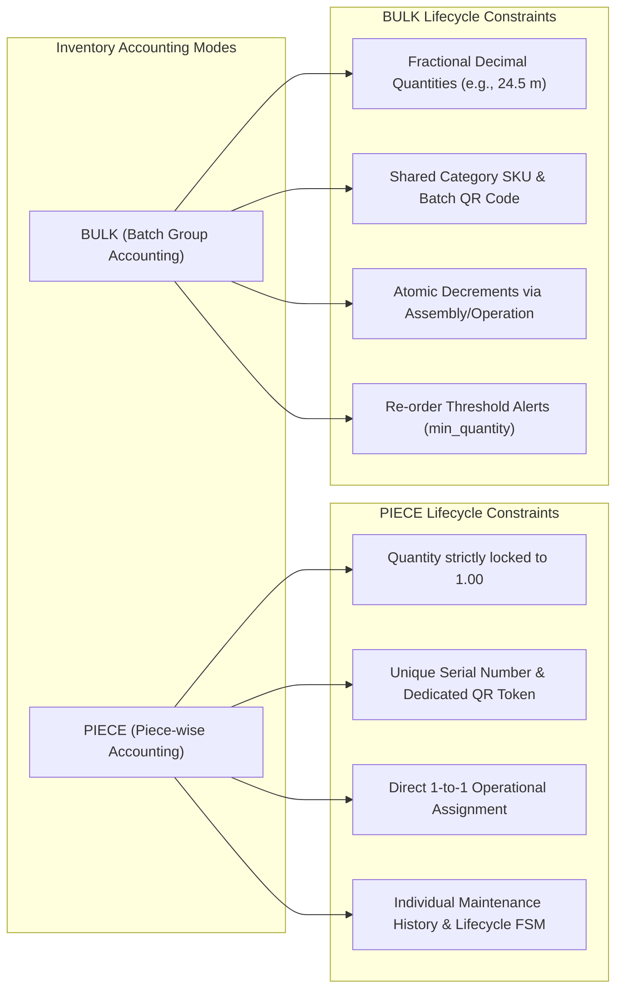
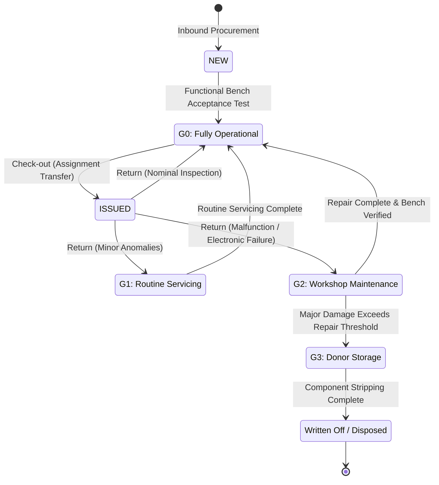
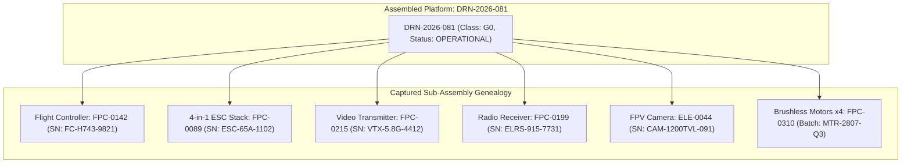
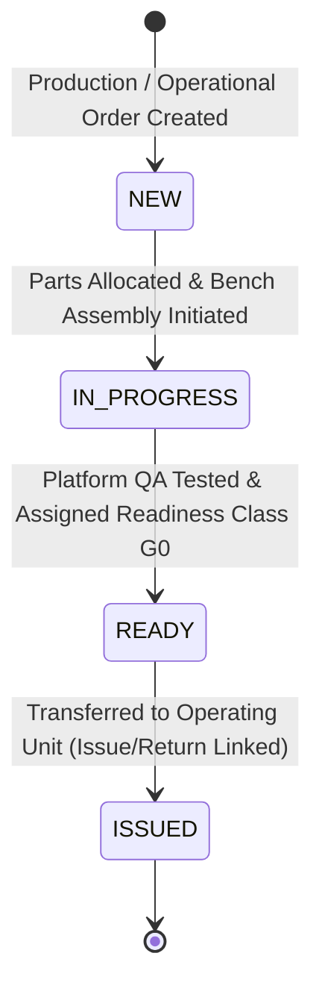

# Hardware Traceability, Taxonomy & Lifecycle Specification (Deus Drones ERP)

---

## 1. Domain Scope & Inventory Classification

Managing hardware assembly and operational maintenance for autonomous drone platforms requires strict separation between discrete serialized assets and consumable batch commodities. **Deus Drones ERP** classifies all inventory into **14 standardized categories**, mapping each to a deterministic prefix and an accounting paradigm:

| Category Name | SKU Prefix | Accounting Type | Primary Inventory Classification |
|---|:---:|:---:|---|
| **Antennas & RF** | `ANT` | `BULK` | Telemetry & Video Transceiver Antennas (SMA/RP-SMA/ipex) |
| **Cabling & Wire** | `CAB` | `BULK` | Power harnesses, silicon wiring, signal leads |
| **Optical Fiber** | `FIB` | `BULK` | High-bandwidth tethering and optical spools |
| **3D Printing Equipment** | `3DP` | `PIECE` | Additive manufacturing stations, custom enclosures |
| **Multirotor Platforms** | `FPV` | `PIECE` | Serialized high-speed multirotor platforms |
| **Multirotor Components** | `FPC` | `BULK` | Motors, ESC speed controllers, flight controllers, VTX modules |
| **Heavy Multirotors** | `BIG` | `PIECE` | Heavy payload multirotors and logistics platforms |
| **Survey & Inspection Platforms** | `REC` | `PIECE` | Long-endurance fixed-wing or aerial inspection platforms |
| **Ground Systems** | `NRK` | `PIECE` | Autonomous ground vehicles (AGV/UGV) and mobile relay units |
| **Avionics & Optics** | `ELE` | `BULK` | Thermal sensors, FPV cameras, GPS compass modules |
| **Workshop Tooling** | `TLS` | `BULK` | Precision soldering stations, calibration benches, torque drivers |
| **Raw Materials** | `MAT` | `BULK` | Carbon sheets, heat shrink, thread-lockers, structural solder |
| **Station Equipment** | `EQP` | `PIECE` | Lab oscilloscopes, benchtop power units, radio spectrum analyzers |
| **General Ancillary** | `OTH` | `BULK` | Packaging, protective transport cases, mounting hardware |

---

## 2. Dual-Mode Accounting Paradigm

```mermaid
graph LR
    subgraph AccountingModes [Inventory Accounting Modes]
        Piece["PIECE (Piece-wise Accounting)"]
        Bulk["BULK (Batch Group Accounting)"]
    end

    subgraph PieceBehavior [PIECE Lifecycle Constraints]
        P1["Quantity strictly locked to 1.00"]
        P2["Unique Serial Number & Dedicated QR Token"]
        P3["Direct 1-to-1 Operational Assignment"]
        P4["Individual Maintenance History & Lifecycle FSM"]
    end

    subgraph BulkBehavior [BULK Lifecycle Constraints]
        B1["Fractional Decimal Quantities (e.g., 24.5 m)"]
        B2["Shared Category SKU & Batch QR Code"]
        B3["Atomic Decrements via Assembly/Operation"]
        B4["Re-order Threshold Alerts (min_quantity)"]
    end

    Piece --> P1
    Piece --> P2
    Piece --> P3
    Piece --> P4

    Bulk --> B1
    Bulk --> B2
    Bulk --> B3
    Bulk --> B4
```

### Deterministic Identifier Generation
Inventory numbers are generated dynamically on insertion using an atomic category-scoped sequence:
$$\text{InventoryNumber} = \text{Prefix} - \text{PadZeroes}(\text{SequenceNumber}, 4)$$
*Example:* The third registered multirotor unit receives the permanent identifier `FPV-0003`.

---

## 3. Readiness Classification Finite State Machine (FSM)

Hardware deployed in active workshop operations is evaluated across two orthogonal parameters: **Operational Status** and **Readiness Class (`G0`–`G3`)**.

### 3.1. Readiness Classes (`readiness_class`)
- **`G0` (Operational):** Platform or sub-assembly passes 100% of functional bench diagnostics, bench telemetry checks, and RF power output validation. Ready for immediate deployment.
- **`G1` (Minor Servicing):** Hardware fully functional but requires minor scheduled inspection, propeller balancing, firmware configuration updates, or cosmetic hardware adjustments.
- **`G2` (Workshop Repair):** Hardware unserviceable due to component failure, wear damage, or desoldered electronic connections. Requires workbench diagnostics and component replacement.
- **`G3` (Retired / Donor):** Hardware damaged beyond economically viable repair. Retained in storage strictly as a donor source for salvageable sub-components (screws, arms, functional sensors).

### 3.2. FSM State Transition Workflow

```mermaid
stateDiagram-v2
    [*] --> NEW: Inbound Procurement
    NEW --> G0_OPERATIONAL: Functional Bench Acceptance Test
    
    state "G0: Fully Operational" as G0_OPERATIONAL
    state "G1: Routine Servicing" as G1_SERVICING
    state "G2: Workshop Maintenance" as G2_REPAIR
    state "G3: Donor Storage" as G3_DONOR
    state "Written Off / Disposed" as SCRAPPED

    G0_OPERATIONAL --> ISSUED: Check-out (Assignment Transfer)
    ISSUED --> G0_OPERATIONAL: Return (Nominal Inspection)
    ISSUED --> G1_SERVICING: Return (Minor Anomalies)
    ISSUED --> G2_REPAIR: Return (Malfunction / Electronic Failure)
    
    G1_SERVICING --> G0_OPERATIONAL: Routine Servicing Complete
    
    G2_REPAIR --> G0_OPERATIONAL: Repair Complete & Bench Verified
    G2_REPAIR --> G3_DONOR: Major Damage Exceeds Repair Threshold
    
    G3_DONOR --> SCRAPPED: Component Stripping Complete
    SCRAPPED --> [*]
```

### 3.3. State Mutation Rules
1. **Append-Only Historical Records:** Status transitions cannot overwrite historical records. Every transition creates an append-only journal entry (`IssueReturn`, `Repair`, `WriteOff`, or `AssemblyLog`).
2. **Readiness Constraints on Assembly:** A platform cannot be built using components in `G2`, `G3`, or `IN_REPAIR` status. The BOM engine validates that all consumed sub-assemblies are in `G0` or `NEW` status prior to execution.
3. **Controlled Inputs:** Transitions between readiness classes are strictly validated against predefined enums; arbitrary user string input is rejected at the API schema boundary.

---

## 4. End-to-End Component Genealogy (Digital Platform Passport)

The digital passport architecture guarantees complete forward and backward supply chain traceability:

```mermaid
graph TD
    subgraph Platform [Assembled Platform: DRN-2026-081]
        AF["DRN-2026-081 (Class: G0, Status: OPERATIONAL)"]
    end

    subgraph Genealogy [Captured Sub-Assembly Genealogy]
        FC["Flight Controller: FPC-0142 (SN: FC-H743-9821)"]
        ESC["4-in-1 ESC Stack: FPC-0089 (SN: ESC-65A-1102)"]
        VTX["Video Transmitter: FPC-0215 (SN: VTX-5.8G-4412)"]
        RX["Radio Receiver: FPC-0199 (SN: ELRS-915-7731)"]
        CAM["FPV Camera: ELE-0044 (SN: CAM-1200TVL-091)"]
        MTR["Brushless Motors x4: FPC-0310 (Batch: MTR-2807-Q3)"]
    end

    AF --> FC
    AF --> ESC
    AF --> VTX
    AF --> RX
    AF --> CAM
    AF --> MTR
```

### Traceability Applications:
- **Forward Impact Analysis (Recall Blast Radius):** If a specific batch of flight controllers (`FPC-0142`) is identified as having a manufacturing flaw, a single database query identifies every assembled platform containing a component from that batch:
  $$\text{AffectedUnits} = \Pi_{\text{created\_item\_id}}(\sigma_{\text{consumed\_item\_id} = \text{target\_id}}(\text{AssemblyConsumedItem}))$$
- **Backward Forensic Analysis:** In the event of an operational malfunction, technicians inspect the digital passport to extract the precise procurement invoice, assembly date, technician ID, and individual component serials.

---

## 5. Production Request & Order Lifecycle (CRM FSM)

In addition to physical platform state machines, inbound customer requests follow a formal Finite State Machine governing workshop throughput and operational dispatch:

```mermaid
stateDiagram-v2
    [*] --> NEW: Production / Operational Order Created
    NEW --> IN_PROGRESS: Parts Allocated & Bench Assembly Initiated
    IN_PROGRESS --> READY: Platform QA Tested & Assigned Readiness Class G0
    READY --> ISSUED: Transferred to Operating Unit (Issue/Return Linked)
    ISSUED --> [*]
```

### Stage Transitions:
1. **`NEW`**: Registered requirement containing requested quantities, platform specifications, target completion date, and priority tag (`LOW`, `NORMAL`, `URGENT`, `CRITICAL`).
2. **`IN_PROGRESS`**: Assigned to lead assembly technician. Sub-component BOM reservation is confirmed in inventory.
3. **`READY`**: Platform assembly completed, benchmark telemetry validated, and completion timestamp recorded. Unit enters warehouse in `G0 (Operational)` status.
4. **`ISSUED`**: Physical assignment transfer completed. Generating an official transfer record links the order directly to the operations journal.

---

## 6. Related Technical Specifications

- [System Landing & Project Overview](README.md)
- [System Architecture Specification](ARCHITECTURE.md)
- [Security, Governance & Resilience](SECURITY_AND_RELIABILITY.md)
